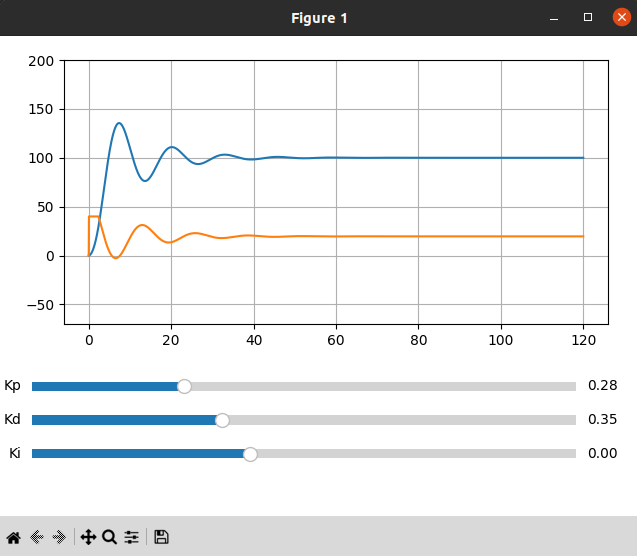

# PID_Simulation
A simulator of the PID controller for a system moving vertically with a free fall acceleration of 9.81. 
A force is applied to the system, this force is regulated by the PID controller. In the described example:
    
    Kp = 0.1 - initial coefficient
    Kd = 0.2 - initial coefficient
    Ki = 0.0001 - initial coefficient
    dt = 0.05 - sampling time of the system
    timelapse = 120 - system simulation time
    setpoint = 100 - setting value
    startpoint = 0 - start value 
    mass = 0.8 - mass of the body
    
These values can be changed

The physical model of the system is described here, the controlling effect is force, the other parameters can be replaced.
    
    Force = force - 9.81*mass
    acc = Force / mass
    currentspeed += acc * dt
    currentpoint += currentspeed * dt + acc * pow(dt, 2) / 2

The algorithm calculates the reaction of the system for the timelapse time with a frequency of 1/dt 
and outputs data to the graph. Blue is the reaction of the system, Orange is the control action.

    
For example, replace gravity with the force of friction against the air. 
The expression for calculating air resistance is very approximate and unsuitable for real calculations

    Force = force - 0.01 * pow(currentspeed,2) 
    

    
    
